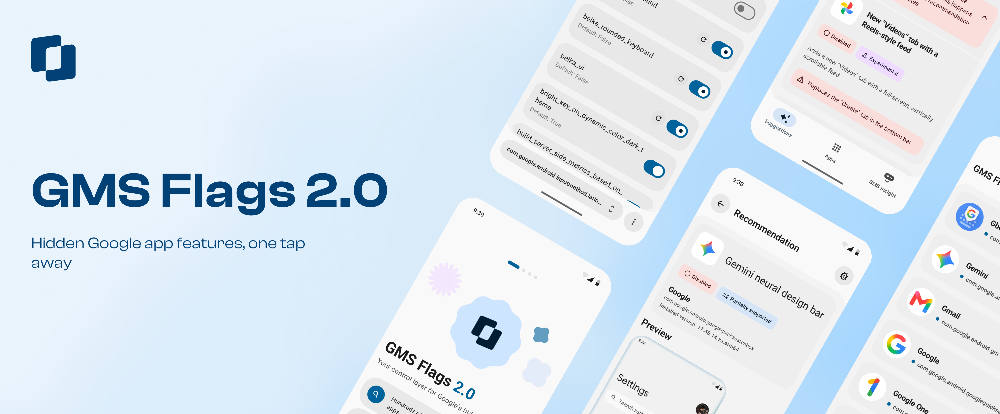

# GMS Flags 2.0

**Hidden Google app features, one tap away.**

> [!IMPORTANT]
> **Requires root access and Xposed/LSPosed.** The app will not run without both — see [Requirements](#requirements).

**GMS Flags** is an Android root/Xposed app that lets you view and override Google's hidden
[Phenotype](https://developer.android.com/reference/com/google/android/gms/common/moduleinstall/InstallStatusListener)
configuration flags — the same server-controlled feature flags Google uses internally to gate
in-progress features, A/B tests, and rollouts across Gboard, YouTube, Google Photos, Play Store,
and the rest of the Google app suite.

With root access and Xposed/LSPosed, GMS Flags reads and writes these flags directly on your
device, so you can turn on features before they officially ship, revert a change that broke
something, or just see what a given app has stashed behind a flag.

## From 1.0 to 2.0

[GMS Flags 1.0](https://github.com/polodarb/GMS-Flags) shipped in 2023 and did one thing: flip a
Phenotype flag with a root shell command. It picked up almost a thousand stars, but Google
eventually changed enough underneath it that it stopped working reliably — it's since been
archived in favor of [GMS Phixit](https://github.com/polodarb/GMS-Phixit).

GMS Flags 2.0 isn't a fork or someone picking up an abandoned project — same developer, same idea,
built again from the ground up as a proper sequel. Flag overrides are still the core, but flags
alone can't do everything anymore, so this version adds an Xposed hooking layer for the handful of
things a flag flip can't reach, curated recommendation combos with an honest "does this actually
work on your install" check, and signed micro-hooks that are cryptographically verified before
they're ever installed.

## Features

- **Browse & search** every Phenotype flag for a supported app, grouped by package
- **Override** boolean, int, float, and string flags, individually or in bulk
- **Curated recommendations** — flag combinations known to unlock a specific feature, with a
  one-tap apply/undo and an honest "does this actually work on your install" status check
- **Signed micro-hooks** (Needle) for the handful of features that need more than a flag flip —
  every hook is verified against an ECDSA P-256 signature before it's ever installed
- **Import/export** flag sets as `.gmsflags` files, including per-flag package overrides for
  multi-package apps
- **Hook status dashboard** — see at a glance which supported apps the Xposed module is actually
  attached to, and why one isn't
- Privacy-conscious analytics: opt-in, no PII collection — boolean/int/float flag values are
  logged to help shape recommendations, but string flags never are, since those can carry tokens
  or emails and stay on-device

## Supported Apps

46 apps across Google's ecosystem, all with full flag override support:

Show the full list

| | | |
|---|---|---|
| AICore | Google Calendar | Keep |
| Android System Intelligence | Google Camera | Messages |
| Clock | Google Drive | Now Playing |
| Contacts | Google Home | Pixel Agent |
| Credential Manager | Google Maps | Pixel Aurelius |
| Diagnostics Tool | Google Meet | Pixel Creative Assistant |
| Digital Wellbeing | Google One | Pixel Customization |
| Family Link | Google Phone | Pixel Live Wallpaper |
| Files by Google | Google Photos | Recorder |
| Find Hub | Google Play Store | Safety Hub |
| Fitbit | Google TV | Tailwind |
| Gboard | Google Translate | Tasks |
| Gemini | Google Wallet | Tips |
| Giant | Google Weather | Wear Companion |
| Gmail | Health Connect | Whisk |
| Google App | | |

Don't see an app you were expecting? Signed micro-hooks (Needle) can extend to new packages without
an app update — see [Features](#features).

## Requirements

- Android 10 (API 29) or newer
- Root access (Magisk or equivalent)
- Xposed/LSPosed — required, the app does not function without it

## Download

Prebuilt APKs are published on the [Releases page](https://github.com/polodarb/GMS-Flags-Reborn/releases)
once a build is cut.

## Disclaimer

GMS Flags changes low-level settings inside other apps. Most flags are harmless, but some can
affect how an app behaves — every override is reversible, but you apply changes at your own
discretion and risk. This project is independently developed and is not affiliated with, endorsed
by, or sponsored by Google LLC.

## Also By Me: GMS Insight

**[GMS Insight](https://play.google.com/store/apps/details?id=ua.polodarb.gmsinsight)** is my other
app — it tracks what changes inside Google apps between updates (strings, resources, manifests) and
uses AI to explain what's actually being prepared next. Flag discovery is coming soon.

> *And well, let's see how long GMS Flags 2.0 lasts before Google decides to kill this one too :)*

## License

Licensed under the [Apache License 2.0](LICENSE).
